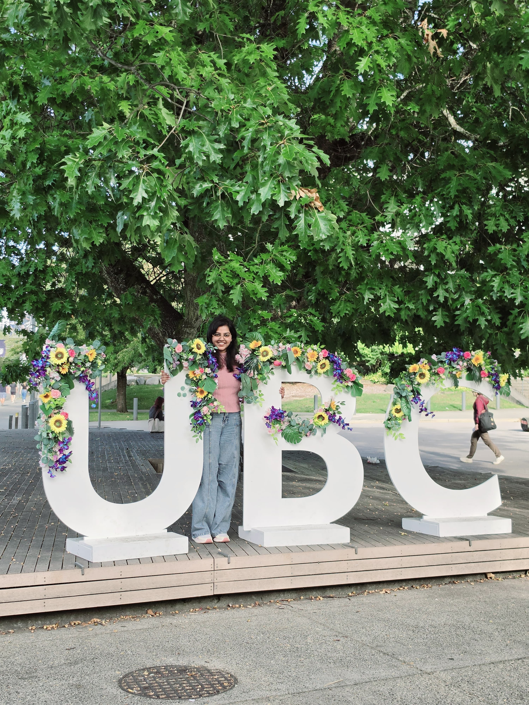

## Dear Diary 📖, MDS Is Wild🤯... ✍️ 

Me before MDS: *"I've got this."*

Me after Week 2: *"Who invited Git, Quarto, Bash, Python, R and five deadlines to the same party?"* 😭

I knew MDS would be challenging, but I didn't expect it to hit the gas pedal on day one. Somewhere between orientation and my first assignment, I realized that "I'll catch up tomorrow" is a dangerous sentence.

The funny part? Every time I think I've finally figured something out, the course casually introduces three new things I've never heard of before. It's a constant cycle of confusion, Googling, tiny victories, and celebrating because my terminal finally stopped yelling at me.

Would I choose this chaos again? Absolutely. Ask me again during quiz week... and the answer might depend on how much coffee I've had. ☕😄

